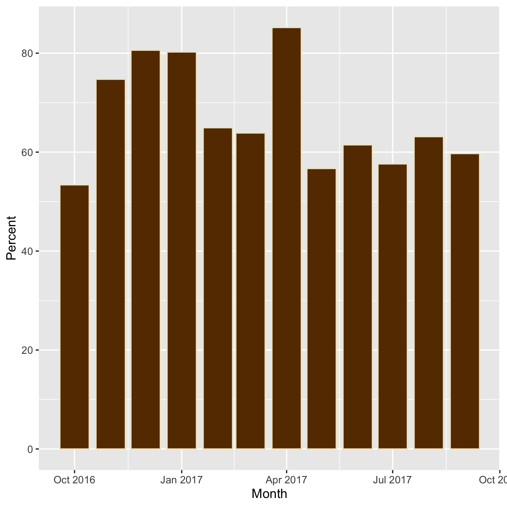

---
title: "Data Visualization with R"
subtitle: "Alex Pacheco"
author: "Research Computing"
date: "2019-03-04"
output:
  slidy_presentation: 
    fig_width: 7
    fig_height: 6
    always_allow_html: yes
runtime: shiny
---  

## Outline

* What is Data Visualization?
* R Graphics
     - ```ggplot2```
     - Interactive graphics using ```plotly```
     - Animations using ```gganimate```

## What is Data Visualization?

* __Data visualization__ or __data visualisation__ is viewed by many disciplines as a modern equivalent of visual communication.
* It involves the creation and study of the visual representation of data.
* A primary goal of data visualization is to communicate information clearly and efficiently via statistical graphics, plots and information graphics. 
* Data visualization is both an art and a science.

## Data Visualization Tools

* There are vast number of Data Visualization Tools targeted for different audiences
* A few used by academic researchers 
     * Tableau
     * Google Charts
     * R
     * Python
     * Matlab
     * GNUPlot

   


## ggplot2 Package


- "gg" stands for Grammar-of-Graphics
- The idea is that any data graphics can be described by specifying
    - A dataset
    - Visual marks that represent data points
    - A coordination system
- ```ggplot2``` package in R is an implementation of it
    - Versatile
    - Clear and consistent interface
    - Beautiful output


## Datasets Used

* Most examples here are based on standard datasets available as R packages


```
## ── Attaching packages ─────────────────────────────────── tidyverse 1.2.1 ──
```

```
## ✔ ggplot2 3.1.0.9000     ✔ purrr   0.2.5     
## ✔ tibble  2.0.1          ✔ dplyr   0.8.0.1   
## ✔ tidyr   0.8.2          ✔ stringr 1.4.0     
## ✔ readr   1.3.1          ✔ forcats 0.4.0
```

```
## ── Conflicts ────────────────────────────────────── tidyverse_conflicts() ──
## ✖ dplyr::filter() masks stats::filter()
## ✖ dplyr::lag()    masks stats::lag()
```

```
## 
## Attaching package: 'lubridate'
```

```
## The following object is masked from 'package:base':
## 
##     date
```

```
## 
## Attaching package: 'plotly'
```

```
## The following object is masked from 'package:ggplot2':
## 
##     last_plot
```

```
## The following object is masked from 'package:stats':
## 
##     filter
```

```
## The following object is masked from 'package:graphics':
## 
##     layout
```

```
## 
## Attaching package: 'gcookbook'
```

```
## The following object is masked from 'package:plotly':
## 
##     wind
```

```
## 
## Attaching package: 'maps'
```

```
## The following object is masked from 'package:purrr':
## 
##     map
```

* Whereever available, we will use data for Sol used for the R Programming tutorial


## Recap Example for R Programming Tutorial


```r
daily <- read_delim('http://webapps.lehigh.edu/hpc/training/soldaily1617-public.csv',delim=";",trim_ws = TRUE)
```

```
## Parsed with column specification:
## cols(
##   Type = col_character(),
##   Name = col_character(),
##   Department = col_character(),
##   PI = col_character(),
##   PIDept = col_character(),
##   Status = col_character(),
##   Day = col_date(format = ""),
##   SerialJ = col_double(),
##   Serial = col_double(),
##   SingleJ = col_double(),
##   Single = col_double(),
##   MultiJ = col_double(),
##   Multi = col_double(),
##   TotalJ = col_double(),
##   Total = col_double()
## )
```

```r
ay1617su <- c(580320.00,561600.00,580320.00,580320.00,524160.00,580320.00,699840.00,955296.00,924480.00,955296.00,955296.00,924480.00)
```

## Basic Concepts of ggplot2

Grammar of Graphics components:

- Data: Use the ```ggplot``` function to indicate what data to use
- Visual marks: Use ```geom_xxx``` functions to indicate what types of visual marks to use
    - Points, lines, area, etc.
- Mapping: Use aesthetic properties (```aes()``` function) to map variables to visual marks
    - Color, shape, size, x, y, etc.


```r
ggplot(heightweight, # What data to use
       aes(x=weightLb,y=heightIn)) + # Aesthetic specifies variables
  geom_point() # Geom specifies visual marks 
```


```r
heightweight %>% head
```

```
##   sex ageYear ageMonth heightIn weightLb
## 1   f   11.92      143     56.3     85.0
## 2   f   12.92      155     62.3    105.0
## 3   f   12.75      153     63.3    108.0
## 4   f   13.42      161     59.0     92.0
## 5   f   15.92      191     62.5    112.5
## 6   f   14.25      171     62.5    112.0
```


## Histogram


```r
ggplot(mpg,aes(x=hwy)) + 
  geom_histogram(binwidth=5, fill="white", color="black")
```


```r
mpg  %>% head
```

```
## # A tibble: 6 x 11
##   manufacturer model displ  year   cyl trans  drv     cty   hwy fl    class
##   <chr>        <chr> <dbl> <int> <int> <chr>  <chr> <int> <int> <chr> <chr>
## 1 audi         a4      1.8  1999     4 auto(… f        18    29 p     comp…
## 2 audi         a4      1.8  1999     4 manua… f        21    29 p     comp…
## 3 audi         a4      2    2008     4 manua… f        20    31 p     comp…
## 4 audi         a4      2    2008     4 auto(… f        21    30 p     comp…
## 5 audi         a4      2.8  1999     6 auto(… f        16    26 p     comp…
## 6 audi         a4      2.8  1999     6 manua… f        18    26 p     comp…
```

## Contours


```r
ggplot(faithfuld, aes(waiting, eruptions, z = density))+
  geom_raster(aes(fill = density)) +
  geom_contour(colour = "white")
```


```r
faithfuld  %>% head
```

```
## # A tibble: 6 x 3
##   eruptions waiting density
##       <dbl>   <dbl>   <dbl>
## 1      1.6       43 0.00322
## 2      1.65      43 0.00384
## 3      1.69      43 0.00444
## 4      1.74      43 0.00498
## 5      1.79      43 0.00542
## 6      1.84      43 0.00574
```


## Bar Charts


```r
monthly <- daily %>% 
  group_by(Month=floor_date(as.Date(Day), "month"),
    Name,Department,PI,PIDept,Status) %>% 
  summarize(Serial=sum(as.double(Serial)),Single=sum(as.double(Single)),
    Multi=sum(as.double(Multi)),Total=sum(as.double(Total)),
    SerialJ=sum(as.double(SerialJ)),SingleJ=sum(as.double(SingleJ)),
    MultiJ=sum(as.double(MultiJ)),TotalJ=sum(as.double(TotalJ))) 
monthly %>%
  group_by(Month) %>%	
  summarize(Total=round(sum(as.double(Total)),2), 
    Jobs=round(sum(as.double(TotalJ)))) %>%
  mutate(Available=ay1617su,Unused=Available-Total,
    Percent=round(Total/Available*100,2)) 
```

```
## # A tibble: 12 x 6
##    Month        Total  Jobs Available  Unused Percent
##    <date>       <dbl> <dbl>     <dbl>   <dbl>   <dbl>
##  1 2016-10-01 309806.   794    580320 270514.    53.4
##  2 2016-11-01 419687. 24315    561600 141913.    74.7
##  3 2016-12-01 467733. 21529    580320 112587.    80.6
##  4 2017-01-01 465625.  7468    580320 114695.    80.2
##  5 2017-02-01 340313. 12382    524160 183847.    64.9
##  6 2017-03-01 370640. 12456    580320 209680.    63.9
##  7 2017-04-01 596186.  7264    699840 103654.    85.2
##  8 2017-05-01 541595. 22755    955296 413701.    56.7
##  9 2017-06-01 568319.  6293    924480 356161.    61.5
## 10 2017-07-01 550470. 20104    955296 404826.    57.6
## 11 2017-08-01 603052. 46016    955296 352244.    63.1
## 12 2017-09-01 551961. 31155    924480 372519.    59.7
```


```r
monthly %>%
  group_by(Month) %>%	
  summarize(Total=round(sum(as.double(Total)),2), Jobs=round(sum(as.double(TotalJ)))) %>%
  mutate(Available=ay1617su,Unused=Available-Total,
    Percent=round(Total/Available*100,2)) %>%
  ggplot(aes(Month,Percent)) + geom_col()
```


## Maps with ggplot2 


- Combined with the ```maps``` package, one can create geographical graphs


```r
states <- map_data("state")
midatl <- subset(states, region %in% c("pennsylvania", "new york", "new jersey"))

ggplot(midatl, aes(x=long,y=lat,group=group, fill=region)) +
  geom_polygon(color="black") +
  scale_fill_brewer(palette="Set2") 
```


## List of Geoms in ggplot2


There are more than 30 geoms in ggplot2:

- One variable
    - geom_bar
    - geom_col
    - geom_area
- Two variables
    - geom_point
    - geom_smooth
    - geom_text
    - geom_boxplot


- Graphic primitives
    - geom_path
    - geom_polygon
- Error visualizatoin
    - geom_errorbar
- Special
    - geom_map
    - geom_contour
    
    
## Customizing Appearance of Data Points


- Appearance of Data Points can be customized with the ```geom``` functions
    - Color
    - Shape (symbol)
    - Size
    - Alpha (transparency)


```r
ggplot(heightweight, aes(x=weightLb,y=heightIn)) + 
  geom_point(shape=2,size=5,color='red',alpha=0.5)
```


```
## Error in loadNamespace(name): there is no package called 'webshot'
```

## Notes on Colors

- A list of possible color names can be obtained with the function ```colors()```
- Can also use hex values
    - Starts with a "#", e.g. "#FFFFFF" 


```r
colors()
```

```
##   [1] "white"                "aliceblue"            "antiquewhite"        
##   [4] "antiquewhite1"        "antiquewhite2"        "antiquewhite3"       
##   [7] "antiquewhite4"        "aquamarine"           "aquamarine1"         
##  [10] "aquamarine2"          "aquamarine3"          "aquamarine4"         
##  [13] "azure"                "azure1"               "azure2"              
##  [16] "azure3"               "azure4"               "beige"               
##  [19] "bisque"               "bisque1"              "bisque2"             
##  [22] "bisque3"              "bisque4"              "black"               
##  [25] "blanchedalmond"       "blue"                 "blue1"               
##  [28] "blue2"                "blue3"                "blue4"               
##  [31] "blueviolet"           "brown"                "brown1"              
##  [34] "brown2"               "brown3"               "brown4"              
##  [37] "burlywood"            "burlywood1"           "burlywood2"          
##  [40] "burlywood3"           "burlywood4"           "cadetblue"           
##  [43] "cadetblue1"           "cadetblue2"           "cadetblue3"          
##  [46] "cadetblue4"           "chartreuse"           "chartreuse1"         
##  [49] "chartreuse2"          "chartreuse3"          "chartreuse4"         
##  [52] "chocolate"            "chocolate1"           "chocolate2"          
##  [55] "chocolate3"           "chocolate4"           "coral"               
##  [58] "coral1"               "coral2"               "coral3"              
##  [61] "coral4"               "cornflowerblue"       "cornsilk"            
##  [64] "cornsilk1"            "cornsilk2"            "cornsilk3"           
##  [67] "cornsilk4"            "cyan"                 "cyan1"               
##  [70] "cyan2"                "cyan3"                "cyan4"               
##  [73] "darkblue"             "darkcyan"             "darkgoldenrod"       
##  [76] "darkgoldenrod1"       "darkgoldenrod2"       "darkgoldenrod3"      
##  [79] "darkgoldenrod4"       "darkgray"             "darkgreen"           
##  [82] "darkgrey"             "darkkhaki"            "darkmagenta"         
##  [85] "darkolivegreen"       "darkolivegreen1"      "darkolivegreen2"     
##  [88] "darkolivegreen3"      "darkolivegreen4"      "darkorange"          
##  [91] "darkorange1"          "darkorange2"          "darkorange3"         
##  [94] "darkorange4"          "darkorchid"           "darkorchid1"         
##  [97] "darkorchid2"          "darkorchid3"          "darkorchid4"         
## [100] "darkred"              "darksalmon"           "darkseagreen"        
## [103] "darkseagreen1"        "darkseagreen2"        "darkseagreen3"       
## [106] "darkseagreen4"        "darkslateblue"        "darkslategray"       
## [109] "darkslategray1"       "darkslategray2"       "darkslategray3"      
## [112] "darkslategray4"       "darkslategrey"        "darkturquoise"       
## [115] "darkviolet"           "deeppink"             "deeppink1"           
## [118] "deeppink2"            "deeppink3"            "deeppink4"           
## [121] "deepskyblue"          "deepskyblue1"         "deepskyblue2"        
## [124] "deepskyblue3"         "deepskyblue4"         "dimgray"             
## [127] "dimgrey"              "dodgerblue"           "dodgerblue1"         
## [130] "dodgerblue2"          "dodgerblue3"          "dodgerblue4"         
## [133] "firebrick"            "firebrick1"           "firebrick2"          
## [136] "firebrick3"           "firebrick4"           "floralwhite"         
## [139] "forestgreen"          "gainsboro"            "ghostwhite"          
## [142] "gold"                 "gold1"                "gold2"               
## [145] "gold3"                "gold4"                "goldenrod"           
## [148] "goldenrod1"           "goldenrod2"           "goldenrod3"          
## [151] "goldenrod4"           "gray"                 "gray0"               
## [154] "gray1"                "gray2"                "gray3"               
## [157] "gray4"                "gray5"                "gray6"               
## [160] "gray7"                "gray8"                "gray9"               
## [163] "gray10"               "gray11"               "gray12"              
## [166] "gray13"               "gray14"               "gray15"              
## [169] "gray16"               "gray17"               "gray18"              
## [172] "gray19"               "gray20"               "gray21"              
## [175] "gray22"               "gray23"               "gray24"              
## [178] "gray25"               "gray26"               "gray27"              
## [181] "gray28"               "gray29"               "gray30"              
## [184] "gray31"               "gray32"               "gray33"              
## [187] "gray34"               "gray35"               "gray36"              
## [190] "gray37"               "gray38"               "gray39"              
## [193] "gray40"               "gray41"               "gray42"              
## [196] "gray43"               "gray44"               "gray45"              
## [199] "gray46"               "gray47"               "gray48"              
## [202] "gray49"               "gray50"               "gray51"              
## [205] "gray52"               "gray53"               "gray54"              
## [208] "gray55"               "gray56"               "gray57"              
## [211] "gray58"               "gray59"               "gray60"              
## [214] "gray61"               "gray62"               "gray63"              
## [217] "gray64"               "gray65"               "gray66"              
## [220] "gray67"               "gray68"               "gray69"              
## [223] "gray70"               "gray71"               "gray72"              
## [226] "gray73"               "gray74"               "gray75"              
## [229] "gray76"               "gray77"               "gray78"              
## [232] "gray79"               "gray80"               "gray81"              
## [235] "gray82"               "gray83"               "gray84"              
## [238] "gray85"               "gray86"               "gray87"              
## [241] "gray88"               "gray89"               "gray90"              
## [244] "gray91"               "gray92"               "gray93"              
## [247] "gray94"               "gray95"               "gray96"              
## [250] "gray97"               "gray98"               "gray99"              
## [253] "gray100"              "green"                "green1"              
## [256] "green2"               "green3"               "green4"              
## [259] "greenyellow"          "grey"                 "grey0"               
## [262] "grey1"                "grey2"                "grey3"               
## [265] "grey4"                "grey5"                "grey6"               
## [268] "grey7"                "grey8"                "grey9"               
## [271] "grey10"               "grey11"               "grey12"              
## [274] "grey13"               "grey14"               "grey15"              
## [277] "grey16"               "grey17"               "grey18"              
## [280] "grey19"               "grey20"               "grey21"              
## [283] "grey22"               "grey23"               "grey24"              
## [286] "grey25"               "grey26"               "grey27"              
## [289] "grey28"               "grey29"               "grey30"              
## [292] "grey31"               "grey32"               "grey33"              
## [295] "grey34"               "grey35"               "grey36"              
## [298] "grey37"               "grey38"               "grey39"              
## [301] "grey40"               "grey41"               "grey42"              
## [304] "grey43"               "grey44"               "grey45"              
## [307] "grey46"               "grey47"               "grey48"              
## [310] "grey49"               "grey50"               "grey51"              
## [313] "grey52"               "grey53"               "grey54"              
## [316] "grey55"               "grey56"               "grey57"              
## [319] "grey58"               "grey59"               "grey60"              
## [322] "grey61"               "grey62"               "grey63"              
## [325] "grey64"               "grey65"               "grey66"              
## [328] "grey67"               "grey68"               "grey69"              
## [331] "grey70"               "grey71"               "grey72"              
## [334] "grey73"               "grey74"               "grey75"              
## [337] "grey76"               "grey77"               "grey78"              
## [340] "grey79"               "grey80"               "grey81"              
## [343] "grey82"               "grey83"               "grey84"              
## [346] "grey85"               "grey86"               "grey87"              
## [349] "grey88"               "grey89"               "grey90"              
## [352] "grey91"               "grey92"               "grey93"              
## [355] "grey94"               "grey95"               "grey96"              
## [358] "grey97"               "grey98"               "grey99"              
## [361] "grey100"              "honeydew"             "honeydew1"           
## [364] "honeydew2"            "honeydew3"            "honeydew4"           
## [367] "hotpink"              "hotpink1"             "hotpink2"            
## [370] "hotpink3"             "hotpink4"             "indianred"           
## [373] "indianred1"           "indianred2"           "indianred3"          
## [376] "indianred4"           "ivory"                "ivory1"              
## [379] "ivory2"               "ivory3"               "ivory4"              
## [382] "khaki"                "khaki1"               "khaki2"              
## [385] "khaki3"               "khaki4"               "lavender"            
## [388] "lavenderblush"        "lavenderblush1"       "lavenderblush2"      
## [391] "lavenderblush3"       "lavenderblush4"       "lawngreen"           
## [394] "lemonchiffon"         "lemonchiffon1"        "lemonchiffon2"       
## [397] "lemonchiffon3"        "lemonchiffon4"        "lightblue"           
## [400] "lightblue1"           "lightblue2"           "lightblue3"          
## [403] "lightblue4"           "lightcoral"           "lightcyan"           
## [406] "lightcyan1"           "lightcyan2"           "lightcyan3"          
## [409] "lightcyan4"           "lightgoldenrod"       "lightgoldenrod1"     
## [412] "lightgoldenrod2"      "lightgoldenrod3"      "lightgoldenrod4"     
## [415] "lightgoldenrodyellow" "lightgray"            "lightgreen"          
## [418] "lightgrey"            "lightpink"            "lightpink1"          
## [421] "lightpink2"           "lightpink3"           "lightpink4"          
## [424] "lightsalmon"          "lightsalmon1"         "lightsalmon2"        
## [427] "lightsalmon3"         "lightsalmon4"         "lightseagreen"       
## [430] "lightskyblue"         "lightskyblue1"        "lightskyblue2"       
## [433] "lightskyblue3"        "lightskyblue4"        "lightslateblue"      
## [436] "lightslategray"       "lightslategrey"       "lightsteelblue"      
## [439] "lightsteelblue1"      "lightsteelblue2"      "lightsteelblue3"     
## [442] "lightsteelblue4"      "lightyellow"          "lightyellow1"        
## [445] "lightyellow2"         "lightyellow3"         "lightyellow4"        
## [448] "limegreen"            "linen"                "magenta"             
## [451] "magenta1"             "magenta2"             "magenta3"            
## [454] "magenta4"             "maroon"               "maroon1"             
## [457] "maroon2"              "maroon3"              "maroon4"             
## [460] "mediumaquamarine"     "mediumblue"           "mediumorchid"        
## [463] "mediumorchid1"        "mediumorchid2"        "mediumorchid3"       
## [466] "mediumorchid4"        "mediumpurple"         "mediumpurple1"       
## [469] "mediumpurple2"        "mediumpurple3"        "mediumpurple4"       
## [472] "mediumseagreen"       "mediumslateblue"      "mediumspringgreen"   
## [475] "mediumturquoise"      "mediumvioletred"      "midnightblue"        
## [478] "mintcream"            "mistyrose"            "mistyrose1"          
## [481] "mistyrose2"           "mistyrose3"           "mistyrose4"          
## [484] "moccasin"             "navajowhite"          "navajowhite1"        
## [487] "navajowhite2"         "navajowhite3"         "navajowhite4"        
## [490] "navy"                 "navyblue"             "oldlace"             
## [493] "olivedrab"            "olivedrab1"           "olivedrab2"          
## [496] "olivedrab3"           "olivedrab4"           "orange"              
## [499] "orange1"              "orange2"              "orange3"             
## [502] "orange4"              "orangered"            "orangered1"          
## [505] "orangered2"           "orangered3"           "orangered4"          
## [508] "orchid"               "orchid1"              "orchid2"             
## [511] "orchid3"              "orchid4"              "palegoldenrod"       
## [514] "palegreen"            "palegreen1"           "palegreen2"          
## [517] "palegreen3"           "palegreen4"           "paleturquoise"       
## [520] "paleturquoise1"       "paleturquoise2"       "paleturquoise3"      
## [523] "paleturquoise4"       "palevioletred"        "palevioletred1"      
## [526] "palevioletred2"       "palevioletred3"       "palevioletred4"      
## [529] "papayawhip"           "peachpuff"            "peachpuff1"          
## [532] "peachpuff2"           "peachpuff3"           "peachpuff4"          
## [535] "peru"                 "pink"                 "pink1"               
## [538] "pink2"                "pink3"                "pink4"               
## [541] "plum"                 "plum1"                "plum2"               
## [544] "plum3"                "plum4"                "powderblue"          
## [547] "purple"               "purple1"              "purple2"             
## [550] "purple3"              "purple4"              "red"                 
## [553] "red1"                 "red2"                 "red3"                
## [556] "red4"                 "rosybrown"            "rosybrown1"          
## [559] "rosybrown2"           "rosybrown3"           "rosybrown4"          
## [562] "royalblue"            "royalblue1"           "royalblue2"          
## [565] "royalblue3"           "royalblue4"           "saddlebrown"         
## [568] "salmon"               "salmon1"              "salmon2"             
## [571] "salmon3"              "salmon4"              "sandybrown"          
## [574] "seagreen"             "seagreen1"            "seagreen2"           
## [577] "seagreen3"            "seagreen4"            "seashell"            
## [580] "seashell1"            "seashell2"            "seashell3"           
## [583] "seashell4"            "sienna"               "sienna1"             
## [586] "sienna2"              "sienna3"              "sienna4"             
## [589] "skyblue"              "skyblue1"             "skyblue2"            
## [592] "skyblue3"             "skyblue4"             "slateblue"           
## [595] "slateblue1"           "slateblue2"           "slateblue3"          
## [598] "slateblue4"           "slategray"            "slategray1"          
## [601] "slategray2"           "slategray3"           "slategray4"          
## [604] "slategrey"            "snow"                 "snow1"               
## [607] "snow2"                "snow3"                "snow4"               
## [610] "springgreen"          "springgreen1"         "springgreen2"        
## [613] "springgreen3"         "springgreen4"         "steelblue"           
## [616] "steelblue1"           "steelblue2"           "steelblue3"          
## [619] "steelblue4"           "tan"                  "tan1"                
## [622] "tan2"                 "tan3"                 "tan4"                
## [625] "thistle"              "thistle1"             "thistle2"            
## [628] "thistle3"             "thistle4"             "tomato"              
## [631] "tomato1"              "tomato2"              "tomato3"             
## [634] "tomato4"              "turquoise"            "turquoise1"          
## [637] "turquoise2"           "turquoise3"           "turquoise4"          
## [640] "violet"               "violetred"            "violetred1"          
## [643] "violetred2"           "violetred3"           "violetred4"          
## [646] "wheat"                "wheat1"               "wheat2"              
## [649] "wheat3"               "wheat4"               "whitesmoke"          
## [652] "yellow"               "yellow1"              "yellow2"             
## [655] "yellow3"              "yellow4"              "yellowgreen"
```


## Adding More Layers to A Plot

- New layers can be added to a plot by using ```geom_xxx``` functions


```r
monthly %>%
  group_by(Month) %>%	
  summarize(Total=round(sum(as.double(Total)),2), Jobs=round(sum(as.double(TotalJ)))) %>%
  mutate(Available=ay1617su,Unused=Available-Total,
    Percent=round(Total/Available*100,2)) %>%
  ggplot(aes(Month,Percent)) + geom_col() +
  geom_point(aes(size=Jobs))
```


## More on Aesthetic Mapping

- Aesthetic mappings describe how variables in the data are mapped to visual properties
    - Colors, shapes, sizes, transparency etc.
    - Controlled by the ```aes()``` function
    - Can be specified in either ``ggplot`` function or individual layers
        - Aesthetic mappings specified in ```ggplot``` are default, but can be overriden in individual layers


## Mapping  Variables to Aesthetic Properties


- Continous and Discrete data values can be mapped to an aesthetic value to group data points


```r
daily %>%
  group_by(Month=floor_date(as.Date(Day),"week"), PIDept) %>%
  summarize(Total=round(sum(as.double(Total)),2),Jobs=round(sum(as.double(TotalJ)))) %>%
  ggplot(aes(Month,Total,fill=PIDept, group=PIDept)) + 
  geom_line(aes(color=PIDept)) + geom_point(aes(color=PIDept))
```


Specify the shapes and colors manually:

```r
# Very busy plot, so let's filter some data
daily %>%
  filter(PIDept==" LTS" | PIDept==" Chemistry" | PIDept==" Mathematics" ) %>%
  group_by(Month=floor_date(as.Date(Day),"week"), PIDept) %>%
  summarize(Total=round(sum(as.double(Total)),2)) %>%
  ggplot(aes(Month,Total,fill=PIDept,group=PIDept)) +
  geom_line(aes(color=PIDept)) + geom_point(aes(color=PIDept)) +
  scale_color_manual(values=c("darkorange","brown", "darkolivegreen"))
```


## Labeling individual points


* To label data points, use either ```annotate``` or ```geom_text```


```r
monthly %>%
  group_by(Month) %>%   
  summarize(Total=round(sum(as.double(Total)),2), Jobs=round(sum(as.double(TotalJ)))) %>%
  mutate(Available=ay1617su,Unused=Available-Total,
    Percent=round(Total/Available*100,2)) %>%
  ggplot(aes(Month,Percent)) + geom_col() +
  geom_text(aes(label=Percent), vjust=-1)
```


## Stat Functions


- Some plots visualize a transformation of the original dataset.
- Use a ```stat_xxx``` function to choose a common transformation to visualize.

- Use ```stat_smooth``` function to add a fitted model to the plot:


```r
ggplot(heightweight, aes(x=weightLb,y=heightIn)) + 
  geom_point(aes(shape=sex,color=sex),size=4) +
  scale_shape_manual(values=c(1,4)) +
  scale_color_manual(values=c("blue","green")) +
  stat_smooth(method = lm, level=0.95)
```


-  ```stat_bin()``` function creates a frequency count:


```r
ggplot(mpg,aes(x=hwy)) + stat_bin(binwidth = 5)
```


- This is equivalent to:


```r
ggplot(mpg,aes(x=hwy)) + geom_bar(binwidth = 5)
```

- Or:


```r
ggplot(mpg,aes(x=hwy)) + 
  geom_bar(stat="bin", binwidth = 5) 
# The "bin" stat is the implied default for histogram
```

- Use ```stat_count``` for discrete data


```r
daily %>% 
  group_by(Name,Status) %>% 
  summarize(Total=round(sum(as.double(Total)),2)) %>% 
  filter(Total>0) -> usage_status
ggplot(usage_status,aes(x=Status)) + stat_count(width=1)
```


```
## Error in loadNamespace(name): there is no package called 'webshot'
```


## Saving Plot to An Object


- A ```ggplot``` plot can be saved in an object
- More convenient when you are experienting with different geoms and their options


```r
monthlyusage <- monthly %>%
  group_by(Month) %>%	
  summarize(Total=round(sum(as.double(Total)),2), Jobs=round(sum(as.double(TotalJ)))) %>%
  mutate(Available=ay1617su,Unused=Available-Total,
    Percent=round(Total/Available*100,2)) %>%
  ggplot(aes(Month,Percent))
monthlyusage + geom_col()
```


```r
# Here we use the saved plot object "monthlyusage", but a different geom
monthlyusage + geom_line(size=2,color="red") + geom_point(size=6,color="blue")
```


## Saving Plots to Files


With ```ggplot2``` one can use the ```ggsave()``` function to save a plot:

```r
monthlyusage + geom_col(fill="#663700",color="#F1E7C8")
ggsave("solmonthly1617.png",width=6,height=6)
```


<figure>
  
</figure>


<figure>
  
</figure>


## Adding Title, Subtitle and Caption

* To add a title, use either ```ggtitle``` or ```labs(title=)```
   * Note the title is left-aligned by default.


```r
monthlyusage + 
  geom_col(fill="#663700",color="#F1E7C8") + 
  ggtitle("Sol Usage")
```


* To add a subtitle or caption, you need to use ```labs()```


```r
monthlyusage + 
  geom_col(fill="#663700",color="#F1E7C8") + 
  labs(title="Sol Usage",subtitle="AY 2016-17",caption="Visit https://webapps.lehigh.edu/hpc/usage/dashboard.html for daily usage reports")
```


## Adding Axis Labels

- To add axis labels, use either
    - ```xlab``` and ```ylab```, or
    - ```labs(x=,y=)```


```r
monthlyusage + 
  geom_col(fill="#663700",color="#F1E7C8") + 
  ggtitle("Sol Usage") +
  xlab("Month") + ylab("% Used")
```


## Legend Titles

- Use ```labs(<aes>=)``` to specify legend titles


```r
weeklyusage <- daily %>%
  group_by(Month=floor_date(as.Date(Day),"week"), PIDept) %>%
  summarize(Total=round(sum(as.double(Total)),2),Jobs=round(sum(as.double(TotalJ)))) %>%
  ggplot(aes(Month,Total,group=PIDept)) + 
  geom_line(aes(color=PIDept)) + geom_point(aes(color=PIDept)) +
  ggtitle("Weekly Usage by Department") + 
  xlab("") + ylab("SUs Consumed") 
weeklyusage + labs(color='Department')
```


## Themes

- Themes decide the appearance of a plot
- ```ggplot2``` provides a few pre-defined themes for users to choose from

To use the ```classic``` theme:

```r
p <- ggplot(heightweight, aes(x=weightLb,y=heightIn, color=sex)) + 
  geom_point(aes(shape=sex),size=4)
p + theme_classic()
```


## Package ggthemes


- Additional themes are available from the ```ggthemes``` package

Example: Excel theme

```r
p + theme_excel()
```


```
## Error in loadNamespace(name): there is no package called 'webshot'
```


## Fine-tuning the Theme


- Most elements related to appearance are controlled by the ```theme()``` function.
    - Fonts (family, size, color etc.)
    - Background color
    - Grid lines
    - Axis ticks


-  removing the grid lines


```r
weeklyusage + theme_bw() +
  theme(panel.grid = element_blank())
```


-  removing the vertical ones:


```r
weeklyusage + theme_bw() +
  theme(panel.grid.major.x = element_blank(),
        panel.grid.minor.x = element_blank())
```


- Change the base size and font family:


```r
weeklyusage + theme_bw(base_size = 24, base_family = "Times")
```


- fine tune each element:

```r
weeklyusage + theme_bw(base_size = 24, base_family = "Times") +
  theme(legend.title = element_text(size=20,color="blue"),# Legend title
        legend.text = element_text(size=18,color="red"), # Legend text
        axis.title.x = element_text(size=18,color="red"), # X axis label
        axis.title.y = element_blank(), # Remove Y axis label
        )
```


- The ```element_blank()``` function can be used to remove undesired elements.

- Changing Legend Position


```r
weeklyusage + theme_bw() +
  theme(legend.position = "bottom",
        legend.text = element_text(size=6))
```


```r
weeklyusage + theme_bw() +
  theme(legend.position = c(0.9,0.3))
```


- Change angle of tic labels


```r
usage_pidept <- daily %>% 
  group_by(PIDept) %>%
  summarize(Total=sum(as.double(Total))) %>%
  ggplot(aes(x=reorder(PIDept,-Total),y=Total)) +
  geom_col(fill="#663700",color="#F1E7C8") +
  theme_wsj()
usage_pidept + theme(axis.text.x = element_text(angle = 45, hjust = 1))
```


## List of Theme Elements


Elements that can be adjusted with the ```theme``` function:

```r
theme(line, rect, text, title, aspect.ratio, axis.title, axis.title.x,
  axis.title.x.top, axis.title.y, axis.title.y.right, axis.text, axis.text.x,
  axis.text.x.top, axis.text.y, axis.text.y.right, axis.ticks, axis.ticks.x,
  axis.ticks.y, axis.ticks.length, axis.line, axis.line.x, axis.line.y,
  legend.background, legend.margin, legend.spacing, legend.spacing.x,
  legend.spacing.y, legend.key, legend.key.size, legend.key.height,
  legend.key.width, legend.text, legend.text.align, legend.title,
  legend.title.align, legend.position, legend.direction, legend.justification,
  legend.box, legend.box.just, legend.box.margin, legend.box.background,
  legend.box.spacing, panel.background, panel.border, panel.spacing,
  panel.spacing.x, panel.spacing.y, panel.grid, panel.grid.major,
  panel.grid.minor, panel.grid.major.x, panel.grid.major.y, panel.grid.minor.x,
  panel.grid.minor.y, panel.ontop, plot.background, plot.title, plot.subtitle,
  plot.caption, plot.margin, strip.background, strip.placement, strip.text,
  strip.text.x, strip.text.y, strip.switch.pad.grid, strip.switch.pad.wrap, ...,
  complete = FALSE, validate = TRUE)
```


## Reset the default theme


- The default them is ```theme_grey()```
- Use ```theme_set()``` to change the default


With old default:

```r
weeklyusage
```


With new default:

```r
theme_set(theme_light())
weeklyusage
```


## Creating Your Own Theme

- You can create your own theme and reuse later:

```r
mytheme <- theme_bw(base_size = 24, base_family = "Times") +
  theme(legend.title = element_text(size=20,color="blue"),# Legend title
        legend.text = element_text(size=18,color="red"), # Legend text
        axis.title.x = element_text(size=18,color="red"), # X axis label
        axis.title.y = element_blank(), # Remove Y axis label
        )
monthlyusage <- monthlyusage + 
  geom_col(fill="#663700",color="#F1E7C8") + 
  labs(title="Sol Usage",subtitle="AY 2016-17")  
monthlyusage + mytheme
```


## Coordination systems


- Functions that control the coordination system
    - ```coord_cartesian``` - the default cartesian coordinates
    - ```coord_flip``` - flip X and Y
    - ```coord_polar``` - polar coordinates
    - ```coord_trans``` - transform cartesian coordinates


* Original:

```r
usage_pidept
```


* With flipped coorinates:

```r
usage_pidept + coord_flip()
```


* With transformed Y coordinate:

```r
usage_pidept + coord_flip() + coord_trans(y="sqrt") 
```

```
## Coordinate system already present. Adding new coordinate system, which will replace the existing one.
```


## Axis Limits

- Use the ```xlim()``` and ```ylim()``` functions to set the range of axes:


```r
weeklyusage + theme_light() +
  xlim(as.Date("2016-12-15"),as.Date("2017-06-15")) +
  ylim(0,50000)
```

```
## Warning: Removed 303 rows containing missing values (geom_path).
```

```
## Warning: Removed 318 rows containing missing values (geom_point).
```


```
## Error in loadNamespace(name): there is no package called 'webshot'
```


## Scales

- The ```scale_<aes>_(continuous|discrete|manual|identity|...)``` family of functions controls how data points are mapped to aesthetic values
    - Color
    - Shape
    - Size
    - Alpha (transparency)
    - X and Y location


* If  X or Y is a continuous variable, then you can scale it using ```scale_(x|y)_(continous|log10)```


```r
usage_pidept + 
  theme(axis.text.x = element_text(angle = 45, hjust = 1)) + 
  scale_y_log10()
```


```r
weeklyusage + theme_fivethirtyeight() + scale_y_log10()
```

```
## Warning: Transformation introduced infinite values in continuous y-axis

## Warning: Transformation introduced infinite values in continuous y-axis
```


* Other scales

By default:

```r
ggplot(mpg,aes(x=displ,y=hwy,size=cyl,color=drv, alpha=cty)) +
  geom_point()
```


Re-scaled

```r
ggplot(mpg,aes(x=displ,y=hwy,size=cyl,color=drv, alpha=cty)) +
  geom_point() +
  scale_size_identity() + # Use the values of "cyl" variable for size
  scale_color_manual(values=c("darkblue","rosybrown2","#24FA22")) +
  scale_alpha_continuous(range=c(0.1,1))
```


## Faceting


- Facets divide a plot into subplots based on the values of one or more discrete variables.
- Faceting in ```ggplot2``` is managed by the functions ```facet_grid``` and ```facet_wrap```.

* ```facet_grid```: create a row of panels defined by the variable "drv":


```r
ggplot(mpg, aes(displ, hwy)) + 
  geom_point() +
  facet_grid(. ~ drv)
```


* ```facet_grid```: creates a column of panels defined by the variable "fl":


```r
ggplot(mpg, aes(displ, hwy)) + 
  geom_point() +
  facet_grid(fl ~ .)
```


* ```facet_grid```: creates a matrix of panels defined by the variables "fl" and "drv":

```r
ggplot(mpg, aes(displ, hwy)) + 
  geom_point() +
  facet_grid(fl ~ drv)
```


## Facet_wrap


* ```facet_wrap```: wraps 1d sequence of panels into 2d:


```r
pideptusage <- daily %>%
  group_by(Week=floor_date(as.Date(Day),"week"), PIDept) %>%
  summarize(Total=round(sum(as.double(Total)),2)) %>%
  ggplot(aes(x=Week,y=Total,fill=PIDept, group=PIDept)) +
  geom_line(aes(color=PIDept)) +
  facet_wrap(~PIDept, scales = "free", ncol = 2) + 
  theme(legend.position='none')
pideptusage
```


```r
daily %>% 
  group_by(Department) %>%
  summarize(Total=round(sum(as.double(Total)),2)) %>% 
  filter(Total < 1) -> nousage

deptusage <- daily %>%
  filter(!Department %in% flatten_chr(nousage[1])) %>% 
  group_by(Week=floor_date(as.Date(Day),"week"), Department) %>%
  summarize(Total=round(sum(as.double(Total)),2)) %>%
  ggplot(aes(x=Week,y=Total,fill=Department, group=Department)) +
  geom_line(aes(color=Department)) +
  facet_wrap(~Department, scales = "free", ncol = 2) + 
  theme(legend.position='none')
deptusage
```


## Interactive Visualization

- There are a few R packages that allow interactive visualization
    - Plotly
    - Rbokeh
    - Leaflet
    - Highcharter

- Interactive visualization can be created/embeded in 
    - Rstudio console 
    - R Markdown reports 
    - R Shiny web applications.

## Plotly

* Plotly for R is an interactive, browser-based charting library built on the open source JavaScript graphing library plotly.js. 
* It works entirely locally in your web-browser via the HTML widgets framework. 
* Plotly graphs are interactive: click-and-drag to zoom, shift-drag to pan, click on legend entries to toggle traces.
* Install plotly using  ```install.packages('plotly')```
* Install the latest version of ```ggplot2``` from github
      * ```devtools::install_github("hadley/ggplot2")```


```r
library(plotly)
ggplotly(monthlyusage)
```

```
## Error in loadNamespace(name): there is no package called 'webshot'
```


## Stacked Bar Charts with Plotly


```r
monthly %>% 
  group_by(Month) %>%	
  summarize(Total=round(sum(as.double(Total)),2),Jobs=round(sum(as.double(TotalJ)))) %>%
  mutate(Available=ay1617su,Unused=Available-Total,Percent=round(Total/Available*100,2)) %>%
  plot_ly(x = ~Month, y = ~Total, type = "bar", name = "Consumed" ) %>%
    add_trace(y =  ~ Unused, name = "Unused") %>%
    layout(yaxis = list(title = 'SUs Consumed' ), xaxis = list(title = 'Month' ), barmode = 'stack')
```

```
## Error in loadNamespace(name): there is no package called 'webshot'
```
    
## Pie Charts with Plotly


```r
deptreport <- monthly %>% 
  group_by(Department) %>% 
  summarize(Total=round(sum(as.double(Total)),2),User=n_distinct(Name),Jobs=round(sum(as.double(TotalJ))))
plot_ly(deptreport, values = ~User, labels = ~Department, type = "pie", textposition = 'inside', textinfo = 'label', showlegend = F)    
```

```
## Error in loadNamespace(name): there is no package called 'webshot'
```

## Animations

* __A picture is worth a thousand words__

* __How many words is a video worth?__


* If you have a collection of pictures, you can convert them to gif, mpeg, or any other video format using tools like ImageMagick, ffmpeg, or swftools. 
* R provides tools that will convert a collection of images from plots to video provided you have one of these conversion tools.


```r
library(animation)
library(gganimate)
```


```r
ggplot(mtcars, aes(factor(cyl), mpg)) + 
  geom_boxplot() + 
  # Here comes the gganimate code
  transition_states(
    gear,
    transition_length = 2,
    state_length = 1
  ) +
  enter_fade() + 
  exit_shrink() +
  ease_aes('sine-in-out')
```


```r
library(gapminder)
gpminder <- ggplot(gapminder, 
                   aes(gdpPercap, lifeExp, size = pop, colour = country)) +
  geom_point(alpha = 0.7, show.legend = FALSE) +
  scale_colour_manual(values = country_colors) +
  scale_size(range = c(2, 12)) +
  scale_x_log10() +
  facet_wrap(~continent) +
  # Here comes the gganimate specific bits
  labs(title = 'Year: {frame_time}', x = 'GDP per capita', y = 'life expectancy') +
  transition_time(year) +
  ease_aes('linear')
animate(gpminder, height = 800, width =800)
```


## Animations for Sol Usage


```r
dailyusage_pidept <- daily %>%
  group_by(Day=floor_date(as.Date(Day), "week"), PIDept) %>%
  summarize(Total=round(sum(as.double(Total)),2),
            Jobs=round(sum(as.double(TotalJ)))) %>%
  ggplot(aes(Day,Total,frame=Day,group=PIDept)) + 
  geom_line(aes(col = PIDept)) +
  transition_reveal(Day)
dailyusage_pidept
```


```r
#ani.options(interval = 0.01, ani.width = 640, ani.height = 480)
#gganimate(dailyusage_pidept,'dailyusage.gif')
#ani.options(interval = 0.1, ani.width = 1080, ani.height = 960)
#gganimate(dailyusage_pidept,'dailyusage.mp4')
```


```r
monthlyusage_pi <- daily %>%
  group_by(Day=floor_date(as.Date(Day), "month"), PI) %>%
  summarize(Total=round(sum(as.double(Total)),2),
            Jobs=round(sum(as.double(TotalJ)))) %>%
  ggplot(aes(Day,Total,frame=Day,group=PI)) + 
  geom_line(aes(col = PI)) + 
  geom_point(aes(size=Jobs)) + 
  transition_reveal(Day)
monthlyusage_pi
```


```r
#ani.options(interval = 0.5, ani.width = 640, ani.height = 480)
#gganimate(monthlyusage_pi,'monthlystatus.gif')
#ani.options(interval = 0.5, ani.width = 1080, ani.height = 960)
#gganimate(monthlyusage_pi,'monthlystatus.mp4')
```


```r
weeklyusage_status <- daily %>%
  group_by(Week=floor_date(as.Date(Day), "week"),Status) %>% 
  summarize(Total=round(sum(as.double(Total)),2),
            Jobs=round(sum(as.double(TotalJ)))) %>%
  ggplot(aes(Week,Total,group=Status)) + 
           geom_line(aes(col = Status)) +
  facet_wrap( ~Status, scales = "free", ncol = 2) + 
    theme(legend.position='none') + 
    transition_reveal(Week)
weeklyusage_status
```


```r
#ani.options(interval = 0.1, ani.width = 640, ani.height = 480)
#gganimate(weeklyusage_status,'weeklystatus.gif')
#ani.options(interval = 0.05, ani.width = 1080, ani.height = 960)
#gganimate(weeklyusage_status,'weeklystatus.swf')
```


```r
daily %>%
  group_by(Week=floor_date(as.Date(Day), "week"),Status) %>% 
  summarize(Total=round(sum(as.double(Total)),2),
            Jobs=round(sum(as.double(TotalJ)))) %>%
  ggplot(aes(Week,Total,group=Status)) + 
  geom_line(aes(col = Status)) +
  facet_wrap( ~Status, scales = "free", ncol = 2) + 
  theme(legend.position='none') +
  transition_reveal(Week) #+  ease_aes('linear')
```


