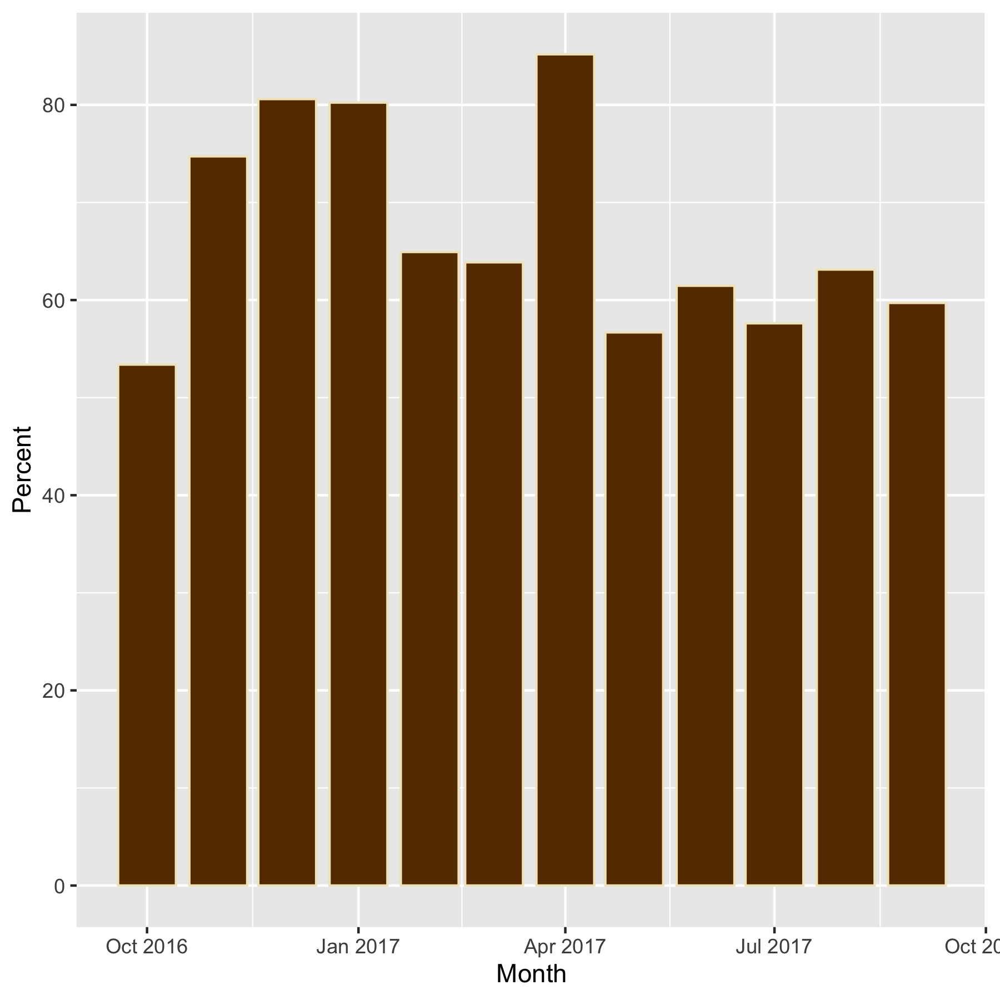
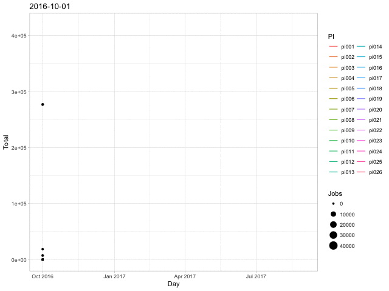
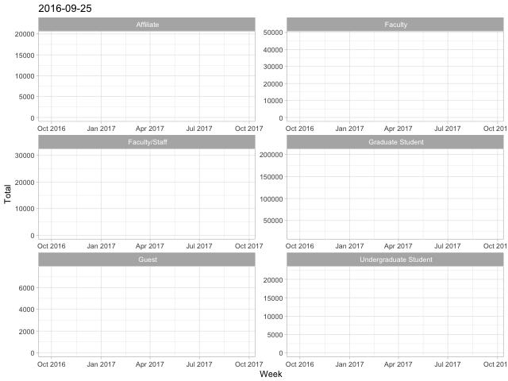

---
title: "Data Visualization with R and Python"
subtitle: "Alex Pacheco"
author: "LTS Research Computing"
date: "2018-04-05"
output:
  slidy_presentation: 
    fig_width: 7
    fig_height: 6
    always_allow_html: yes
runtime: shiny
---  

## Outline

* What is Data Visualization?
* R Graphics
     - ```ggplot2```
* Python Graphics
     - ```matplotlib```

## What is Data Visualization?

* __Data visualization__ or __data visualisation__ is viewed by many disciplines as a modern equivalent of visual communication.
* It involves the creation and study of the visual representation of data.
* A primary goal of data visualization is to communicate information clearly and efficiently via statistical graphics, plots and information graphics. 
* Data visualization is both an art and a science.

## Data Visualization Tools

* There are vast number of Data Visualization Tools targeted for different audiences
* A few used by academic researchers 
     * Tableau
     * Google Charts
     * R
     * Python
     * Matlab
     * GNUPlot
* This training is focussed on R (ggplot2) and to some extend Python (matplotlib).

   


## ggplot2 Package


- "gg" stands for Grammar-of-Graphics
- The idea is that any data graphics can be described by specifying
    - A dataset
    - Visual marks that represent data points
    - A coordination system
- ```ggplot2``` package in R is an implementation of it
    - Versatile
    - Clear and consistent interface
    - Beautiful output


## Datasets Used

* Most examples here are based on standard datasets available as R packages

```{r echo=F,warnings=F,eval=F}
packagelist <- c("tidyverse","devtools","lubridate","plotly","gcookbook","maps")

for (i in seq(1,length(packagelist))) {
  if ( !require(packagelist[i] )) install.packages( packagelist[i], ,repos = "http://cran.us.r-project.org" )
}

```

```{r echo=F}
library(tidyverse)
library(lubridate)
library(plotly)
library(gcookbook)
library(datasets)
library(maps)
library(ggthemes)
library(shiny)
library(shinythemes)
```

* Whereever available, we will use data for Sol used for the R Programming tutorial


## Recap Example for R Programming Tutorial

```{r}
daily <- read_delim('http://webapps.lehigh.edu/hpc/training/soldaily1617-public.csv',delim=";",trim_ws=TRUE)
ay1617su <- c(580320.00,561600.00,580320.00,580320.00,524160.00,580320.00,699840.00,955296.00,924480.00,955296.00,955296.00,924480.00)
```

## Basic Concepts of ggplot2

Grammar of Graphics components:

- Data: Use the ```ggplot``` function to indicate what data to use
- Visual marks: Use ```geom_xxx``` functions to indicate what types of visual marks to use
    - Points, lines, area, etc.
- Mapping: Use aesthetic properties (```aes()``` function) to map variables to visual marks
    - Color, shape, size, x, y, etc.


```{r fig.width=6,fig.height=4}
ggplot(heightweight, # What data to use
       aes(x=weightLb,y=heightIn)) + # Aesthetic specifies variables
  geom_point() # Geom specifies visual marks 
heightweight %>% head
```


## Histogram


```{r fig.width=6,fig.height=4}
ggplot(mpg,aes(x=hwy)) + 
  geom_histogram(binwidth=5, fill="white", color="black")
mpg  %>% head
```

## Contours


```{r fig.width=6,fig.height=4}
ggplot(faithfuld, aes(waiting, eruptions, z = density))+
  geom_raster(aes(fill = density)) +
  geom_contour(colour = "white")
faithfuld  %>% head
```


## Bar Charts


```{r fig.width=6,fig.height=4}
monthly <- daily %>% 
  group_by(Month=floor_date(as.Date(Day), "month"),
    Name,Department,PI,PIDept,Status) %>% 
  summarize(Serial=sum(as.double(Serial)),Single=sum(as.double(Single)),
    Multi=sum(as.double(Multi)),Total=sum(as.double(Total)),
    SerialJ=sum(as.double(SerialJ)),SingleJ=sum(as.double(SingleJ)),
    MultiJ=sum(as.double(MultiJ)),TotalJ=sum(as.double(TotalJ))) 
monthly %>%
  group_by(Month) %>%	
  summarize(Total=round(sum(as.double(Total)),2), 
    Jobs=round(sum(as.double(TotalJ)))) %>%
  mutate(Available=ay1617su,Unused=Available-Total,
    Percent=round(Total/Available*100,2)) 
```


```{r fig.width=6,fig.height=4}
monthly %>%
  group_by(Month) %>%	
  summarize(Total=round(sum(as.double(Total)),2), Jobs=round(sum(as.double(TotalJ)))) %>%
  mutate(Available=ay1617su,Unused=Available-Total,
    Percent=round(Total/Available*100,2)) %>%
  ggplot(aes(Month,Percent)) + geom_col()
```


## Maps with ggplot2 


- Combined with the ```maps``` package, one can create geographical graphs

```{r fig.width=6,fig.height=4}
states <- map_data("state")
midatl <- subset(states, region %in% c("pennsylvania", "new york", "new jersey"))

ggplot(midatl, aes(x=long,y=lat,group=group, fill=region)) +
  geom_polygon(color="black") +
  scale_fill_brewer(palette="Set2") 
```


## List of Geoms in ggplot2


There are more than 30 geoms in ggplot2:

- One variable
    - geom_bar
    - geom_col
    - geom_area
- Two variables
    - geom_point
    - geom_smooth
    - geom_text
    - geom_boxplot


- Graphic primitives
    - geom_path
    - geom_polygon
- Error visualizatoin
    - geom_errorbar
- Special
    - geom_map
    - geom_contour
    
    
## Customizing Appearance of Data Points


- Appearance of Data Points can be customized with the ```geom``` functions
    - Color
    - Shape (symbol)
    - Size
    - Alpha (transparency)


```{r}
ggplot(heightweight, aes(x=weightLb,y=heightIn)) + 
  geom_point(shape=2,size=5,color='red',alpha=0.5)
```

```{r interactive_point_shape,cache=FALSE,echo=FALSE}

shinyApp(
  ui = fluidPage(
    theme = shinytheme("readable"),
    sidebarLayout(
      sidebarPanel(
    sliderInput("shape",
                label = "Point shape",
                min = 0,
                max = 24,
                value = 2)
    ),
      mainPanel(plotOutput("xyPlot",height = "500px"))
    )
  ),
  server = function(input, output) {
    output$xyPlot <- renderPlot(
      ggplot(heightweight, aes(x=weightLb,y=heightIn)) + geom_point(shape=input$shape,size=5,color='red',alpha=0.5)
    )
  },
  options = list(width=800, height=600)
)

```

## Notes on Colors

- A list of possible color names can be obtained with the function ```colors()```
- Can also use hex values
    - Starts with a "#", e.g. "#FFFFFF" 

```{r colors}
colors()
```


## Adding More Layers to A Plot

- New layers can be added to a plot by using ```geom_xxx``` functions

```{r multiple_geoms, warning=FALSE, error=FALSE,fig.width=6,fig.height=4}
monthly %>%
  group_by(Month) %>%	
  summarize(Total=round(sum(as.double(Total)),2), Jobs=round(sum(as.double(TotalJ)))) %>%
  mutate(Available=ay1617su,Unused=Available-Total,
    Percent=round(Total/Available*100,2)) %>%
  ggplot(aes(Month,Percent)) + geom_col() +
  geom_point(aes(size=Jobs))
```


## More on Aesthetic Mapping

- Aesthetic mappings describe how variables in the data are mapped to visual properties
    - Colors, shapes, sizes, transparency etc.
    - Controlled by the ```aes()``` function
    - Can be specified in either ``ggplot`` function or individual layers
        - Aesthetic mappings specified in ```ggplot``` are default, but can be overriden in individual layers


## Mapping  Variables to Aesthetic Properties


- Continous and Discrete data values can be mapped to an aesthetic value to group data points

```{r group_by_sex,fig.width=6,fig.height=4}
daily %>%
  group_by(Month=floor_date(as.Date(Day),"week"), PIDept) %>%
  summarize(Total=round(sum(as.double(Total)),2),Jobs=round(sum(as.double(TotalJ)))) %>%
  ggplot(aes(Month,Total,fill=PIDept, group=PIDept)) + 
  geom_line(aes(color=PIDept)) + geom_point(aes(color=PIDept))
```


Specify the shapes and colors manually:
```{r manual_shape_color,fig.width=6,fig.height=4}
# Very busy plot, so let's filter some data
daily %>%
  filter(PIDept=="LTS" | PIDept=="Chemistry" | PIDept=="Mathematics" ) %>%
  group_by(Month=floor_date(as.Date(Day),"week"), PIDept) %>%
  summarize(Total=round(sum(as.double(Total)),2)) %>%
  ggplot(aes(Month,Total,fill=PIDept,group=PIDept)) +
  geom_line(aes(color=PIDept)) + geom_point(aes(color=PIDept)) +
  scale_color_manual(values=c("darkorange","brown", "darkolivegreen"))
```


## Labeling individual points


* To label data points, use either ```annotate``` or ```geom_text```


```{r label_geom_text,fig.width=6,fig.height=4}
monthly %>%
  group_by(Month) %>%   
  summarize(Total=round(sum(as.double(Total)),2), Jobs=round(sum(as.double(TotalJ)))) %>%
  mutate(Available=ay1617su,Unused=Available-Total,
    Percent=round(Total/Available*100,2)) %>%
  ggplot(aes(Month,Percent)) + geom_col() +
  geom_text(aes(label=Percent), vjust=-1)
```


## Stat Functions


- Some plots visualize a transformation of the original dataset.
- Use a ```stat_xxx``` function to choose a common transformation to visualize.

- Use ```stat_smooth``` function to add a fitted model to the plot:

```{r fitted_model,fig.width=6,fig.height=4}
ggplot(heightweight, aes(x=weightLb,y=heightIn)) + 
  geom_point(aes(shape=sex,color=sex),size=4) +
  scale_shape_manual(values=c(1,4)) +
  scale_color_manual(values=c("blue","green")) +
  stat_smooth(method = lm, level=0.95)
```

-  ```stat_bin()``` function creates a frequency count:

```{r stat_bin,fig.width=6,fig.height=4}
ggplot(mpg,aes(x=hwy)) + stat_bin(binwidth = 5)
```

- This is equivalent to:

```{r stat_bin_equivalent, eval=F,fig.width=6,fig.height=4}
ggplot(mpg,aes(x=hwy)) + geom_bar(binwidth = 5)
```

- Or:

```{r stat_bin_equivalent_2, eval=F,fig.width=6,fig.height=4}
ggplot(mpg,aes(x=hwy)) + 
  geom_bar(stat="bin", binwidth = 5) 
# The "bin" stat is the implied default for histogram
```

- Use ```stat_count``` for discrete data

```{r stat_count, fig.width=6,fig.height=4}
daily %>% 
  group_by(Name,Status) %>% 
  summarize(Total=round(sum(as.double(Total)),2)) %>% 
  filter(Total>0) -> usage_status
ggplot(usage_status,aes(x=Status)) + stat_count(width=1)

``` 


```{r interactive_stat_count,cache=FALSE,echo=FALSE}

shinyApp(
  ui = fluidPage(
    theme = shinytheme("readable"),
    sidebarLayout(
      sidebarPanel(
    sliderInput("shape",
                label = "width",
                min = 0.1,
                max = 2,
                value = 0.25)
    ),
      mainPanel(plotOutput("xyPlot",height = "500px"))
    )
  ),
  server = function(input, output) {
    output$xyPlot <- renderPlot(
      ggplot(usage_status,aes(x=Status)) + stat_count(width=input$shape)
    )
  },
  options = list(width=800, height=600)
)

```


## Saving Plot to An Object


- A ```ggplot``` plot can be saved in an object
- More convenient when you are experienting with different geoms and their options

```{r save_in_object,fig.width=6,fig.height=4}
monthlyusage <- monthly %>%
  group_by(Month) %>%	
  summarize(Total=round(sum(as.double(Total)),2), Jobs=round(sum(as.double(TotalJ)))) %>%
  mutate(Available=ay1617su,Unused=Available-Total,
    Percent=round(Total/Available*100,2)) %>%
  ggplot(aes(Month,Percent))
monthlyusage + geom_col()
```


```{r reuse_object,fig.width=6,fig.height=4}
# Here we use the saved plot object "monthlyusage", but a different geom
monthlyusage + geom_line(size=2,color="red") + geom_point(size=6,color="blue")
```


## Saving Plots to Files


With ```ggplot2``` one can use the ```ggsave()``` function to save a plot:
```{r ggsave, echo=T, results=F, fig.keep='none'}
monthlyusage + geom_col(fill="#663700",color="#F1E7C8")
ggsave("solmonthly1617.png",width=6,height=6)
```


<figure>
  
</figure>


<figure>
  
</figure>


## Adding Title, Subtitle and Caption

* To add a title, use either ```ggtitle``` or ```labs(title=)```
   * Note the title is left-aligned by default.

```{r ggtitle,fig.width=6,fig.height=4}
monthlyusage + 
  geom_col(fill="#663700",color="#F1E7C8") + 
  ggtitle("Sol Usage")
```

* To add a subtitle or caption, you need to use ```labs()```

```{r ggcaption,fig.width=6,fig.height=4}
monthlyusage + 
  geom_col(fill="#663700",color="#F1E7C8") + 
  labs(title="Sol Usage",subtitle="AY 2016-17",caption="Visit https://webapps.lehigh.edu/hpc/usage/dashboard.html for daily usage reports")
```


## Adding Axis Labels

- To add axis labels, use either
    - ```xlab``` and ```ylab```, or
    - ```labs(x=,y=)```

```{r xylabel,fig.width=6,fig.height=4}
monthlyusage + 
  geom_col(fill="#663700",color="#F1E7C8") + 
  ggtitle("Sol Usage") +
  xlab("Month") + ylab("% Used")
```


## Legend Titles

- Use ```labs(<aes>=)``` to specify legend titles

```{r legend_title,fig.width=6,fig.height=4}
weeklyusage <- daily %>%
  group_by(Month=floor_date(as.Date(Day),"week"), PIDept) %>%
  summarize(Total=round(sum(as.double(Total)),2),Jobs=round(sum(as.double(TotalJ)))) %>%
  ggplot(aes(Month,Total,group=PIDept)) + 
  geom_line(aes(color=PIDept)) + geom_point(aes(color=PIDept)) +
  ggtitle("Weekly Usage by Department") + 
  xlab("") + ylab("SUs Consumed") 
weeklyusage + labs(color='Department')
```


## Themes

- Themes decide the appearance of a plot
- ```ggplot2``` provides a few pre-defined themes for users to choose from

To use the ```classic``` theme:
```{r classic_them, fig.width=6,fig.height=4}
p <- ggplot(heightweight, aes(x=weightLb,y=heightIn, color=sex)) + 
  geom_point(aes(shape=sex),size=4)
p + theme_classic()
```


## Package ggthemes


```{r ggthemes, echo=F}
library(ggthemes)
```

- Additional themes are available from the ```ggthemes``` package

Example: Excel theme
```{r excel_theme, fig.width=6,fig.height=4}
p + theme_excel()
```

```{r interactive_theme,cache=FALSE,echo=FALSE,fig.width=6,fig.height=4}
weeklyusage <- weeklyusage + labs(color='Department')
plotType <- function(type) {
  switch(type,
         theme_classic = weeklyusage + theme_classic(),
         theme_bw = weeklyusage + theme_bw(),
         theme_dark = weeklyusage + theme_dark(),
         theme_gray = weeklyusage + theme_gray(),
         theme_light = weeklyusage + theme_light(),
         theme_minimal = weeklyusage + theme_minimal(),
         theme_excel = weeklyusage + theme_excel(),
         theme_economist = weeklyusage + theme_economist(),
         theme_economist_white = weeklyusage + theme_economist_white(),
         theme_wsj = weeklyusage + theme_wsj(),
         theme_fivethirtyeight = weeklyusage + theme_fivethirtyeight(),
         theme_solarized = weeklyusage + theme_solarized()
  )
}
shinyApp(
  ui = fluidPage(
    theme = shinytheme("readable"),
    selectInput("plottheme",
                label = "Plot Theme",
                choices = c("theme_classic","theme_bw","theme_dark","theme_gray","theme_light","theme_minimal","theme_excel","theme_economist","theme_wsj","theme_fivethirtyeight","theme_solarized"),
                selected = "theme_classic"),
      plotOutput("xyPlot", height = "500px")
  ),
  server = function(input, output) {
    
    output$xyPlot <- renderPlot(
      plotType(input$plottheme)
    )
  },
    options = list(width=800, height=600)
)
```


## Fine-tuning the Theme


- Most elements related to appearance are controlled by the ```theme()``` function.
    - Fonts (family, size, color etc.)
    - Background color
    - Grid lines
    - Axis ticks


-  removing the grid lines

```{r remove_grid_line, fig.width=6,fig.height=4}
weeklyusage + theme_bw() +
  theme(panel.grid = element_blank())
```

-  removing the vertical ones:

```{r fig.width=6,fig.height=4}
weeklyusage + theme_bw() +
  theme(panel.grid.major.x = element_blank(),
        panel.grid.minor.x = element_blank())
```

- Change the base size and font family:

```{r customize_fonts, fig.width=12,fig.height=12}
weeklyusage + theme_bw(base_size = 24, base_family = "Times")
```

- fine tune each element:
```{r fig.width=12,fig.height=12}
weeklyusage + theme_bw(base_size = 24, base_family = "Times") +
  theme(legend.title = element_text(size=20,color="blue"),# Legend title
        legend.text = element_text(size=18,color="red"), # Legend text
        axis.title.x = element_text(size=18,color="red"), # X axis label
        axis.title.y = element_blank(), # Remove Y axis label
        )
```

- The ```element_blank()``` function can be used to remove undesired elements.

- Changing Legend Position

```{r fig.width=6,fig.height=4}
weeklyusage + theme_bw() +
  theme(legend.position = "bottom",
        legend.text = element_text(size=6))
```


```{r fig.width=6,fig.height=4}
weeklyusage + theme_bw() +
  theme(legend.position = c(0.9,0.3))
```

- Change angle of tic labels

```{r define_histogram, fig.width=8,fig.height=6}
usage_pidept <- daily %>% 
  group_by(PIDept) %>%
  summarize(Total=sum(as.double(Total))) %>%
  ggplot(aes(x=reorder(PIDept,-Total),y=Total)) +
  geom_col(fill="#663700",color="#F1E7C8") +
  theme_wsj()
usage_pidept + theme(axis.text.x = element_text(angle = 45, hjust = 1))
```


## List of Theme Elements


Elements that can be adjusted with the ```theme``` function:
```{r, eval=F}
theme(line, rect, text, title, aspect.ratio, axis.title, axis.title.x,
  axis.title.x.top, axis.title.y, axis.title.y.right, axis.text, axis.text.x,
  axis.text.x.top, axis.text.y, axis.text.y.right, axis.ticks, axis.ticks.x,
  axis.ticks.y, axis.ticks.length, axis.line, axis.line.x, axis.line.y,
  legend.background, legend.margin, legend.spacing, legend.spacing.x,
  legend.spacing.y, legend.key, legend.key.size, legend.key.height,
  legend.key.width, legend.text, legend.text.align, legend.title,
  legend.title.align, legend.position, legend.direction, legend.justification,
  legend.box, legend.box.just, legend.box.margin, legend.box.background,
  legend.box.spacing, panel.background, panel.border, panel.spacing,
  panel.spacing.x, panel.spacing.y, panel.grid, panel.grid.major,
  panel.grid.minor, panel.grid.major.x, panel.grid.major.y, panel.grid.minor.x,
  panel.grid.minor.y, panel.ontop, plot.background, plot.title, plot.subtitle,
  plot.caption, plot.margin, strip.background, strip.placement, strip.text,
  strip.text.x, strip.text.y, strip.switch.pad.grid, strip.switch.pad.wrap, ...,
  complete = FALSE, validate = TRUE)
```


## Reset the default theme


- The default them is ```theme_grey()```
- Use ```theme_set()``` to change the default


With old default:
```{r fig.width=6,fig.height=4}
weeklyusage
```


With new default:
```{r fig.width=6,fig.height=4}
theme_set(theme_light())
weeklyusage
```


## Creating Your Own Theme

- You can create your own theme and reuse later:
```{r create_own_them, fig.width=6,fig.height=4}
mytheme <- theme_bw(base_size = 24, base_family = "Times") +
  theme(legend.title = element_text(size=20,color="blue"),# Legend title
        legend.text = element_text(size=18,color="red"), # Legend text
        axis.title.x = element_text(size=18,color="red"), # X axis label
        axis.title.y = element_blank(), # Remove Y axis label
        )
monthlyusage <- monthlyusage + 
  geom_col(fill="#663700",color="#F1E7C8") + 
  labs(title="Sol Usage",subtitle="AY 2016-17")  
monthlyusage + mytheme
```


## Coordination systems


- Functions that control the coordination system
    - ```coord_cartesian``` - the default cartesian coordinates
    - ```coord_flip``` - flip X and Y
    - ```coord_polar``` - polar coordinates
    - ```coord_trans``` - transform cartesian coordinates


* Original:
```{r fig.width=6,fig.height=4}
usage_pidept
```


* With flipped coorinates:
```{r fig.width=6,fig.height=4}
usage_pidept + coord_flip()
```

* With transformed Y coordinate:
```{r fig.width=6,fig.height=4}
usage_pidept + coord_flip() + coord_trans(y="sqrt") 
```


## Axis Limits

- Use the ```xlim()``` and ```ylim()``` functions to set the range of axes:

```{r axis_limits, fig.width=6,fig.height=4}
weeklyusage + theme_light() +
  xlim(as.Date("2016-12-15"),as.Date("2017-06-15")) +
  ylim(0,50000)
```

```{r interactive_axis_limits,cache=FALSE, echo=FALSE}
shinyApp(
  ui = fluidPage(
    theme = shinytheme("readable"),
    sidebarLayout(
      sidebarPanel(
    sliderInput("xlimlower",
                label = "X Axis Lower Limit",
                min = as.Date("2016-10-01"), max = as.Date("2017-03-01"),
                value = as.Date("2016-12-01")),
        sliderInput("xlimupper",
                label = "X Axis Upper Limit",
                min = as.Date("2017-04-01"), max = as.Date("2017-09-01"),
                value = as.Date("2017-07-01")),
        sliderInput("ylimlower",
                label = "Y Axis Lower Limit",
                min = 0, max = 50000,
                value = 50),
        sliderInput("ylimupper",
                label = "Y Axis Upper Limit",
                min = 10000, max = 210000,
                value = 150000)
      ),
     mainPanel(plotOutput("xyPlot"))
    )
  ),
  server = function(input, output) {
    output$xyPlot <- renderPlot(
      weeklyusage + theme_light() + xlim(input$xlimlower,input$xlimupper) + ylim(input$ylimlower,input$ylimupper)
    )
  },
  options = list(height=600)
)
```


## Scales

- The ```scale_<aes>_(continuous|discrete|manual|identity|...)``` family of functions controls how data points are mapped to aesthetic values
    - Color
    - Shape
    - Size
    - Alpha (transparency)
    - X and Y location


* If  X or Y is a continuous variable, then you can scale it using ```scale_(x|y)_(continous|log10)```


```{r scale_y_log10, fig.width=6,fig.height=4}
usage_pidept + 
  theme(axis.text.x = element_text(angle = 45, hjust = 1)) + 
  scale_y_log10()
weeklyusage + theme_fivethirtyeight() + scale_y_log10()
```


* Other scales

By default:
```{r scales_before, fig.width=6,fig.height=4}
ggplot(mpg,aes(x=displ,y=hwy,size=cyl,color=drv, alpha=cty)) +
  geom_point()
```


Re-scaled
```{r scales_after, fig.width=6,fig.height=4}
ggplot(mpg,aes(x=displ,y=hwy,size=cyl,color=drv, alpha=cty)) +
  geom_point() +
  scale_size_identity() + # Use the values of "cyl" variable for size
  scale_color_manual(values=c("darkblue","rosybrown2","#24FA22")) +
  scale_alpha_continuous(range=c(0.1,1))
```


## Faceting


- Facets divide a plot into subplots based on the values of one or more discrete variables.
- Faceting in ```ggplot2``` is managed by the functions ```facet_grid``` and ```facet_wrap```.

* ```facet_grid```: create a row of panels defined by the variable "drv":

```{r facet_grid_drv, fig.width=6,fig.height=4}
ggplot(mpg, aes(displ, hwy)) + 
  geom_point() +
  facet_grid(. ~ drv)
```

* ```facet_grid```: creates a column of panels defined by the variable "fl":

```{r facet_grid_fl, fig.width=6,fig.height=4}
ggplot(mpg, aes(displ, hwy)) + 
  geom_point() +
  facet_grid(fl ~ .)
```

* ```facet_grid```: creates a matrix of panels defined by the variables "fl" and "drv":
```{r facet_grid_both, fig.width=6,fig.height=4}
ggplot(mpg, aes(displ, hwy)) + 
  geom_point() +
  facet_grid(fl ~ drv)
```


## Facet_wrap


* ```facet_wrap```: wraps 1d sequence of panels into 2d:

```{r facet_wrap_pidept, warnings=F, fig.width=8,fig.height=10}
pideptusage <- daily %>%
  group_by(Week=floor_date(as.Date(Day),"week"), PIDept) %>%
  summarize(Total=round(sum(as.double(Total)),2)) %>%
  ggplot(aes(x=Week,y=Total,fill=PIDept, group=PIDept)) +
  geom_line(aes(color=PIDept)) +
  facet_wrap(~PIDept, scales = "free", ncol = 2) + 
  theme(legend.position='none')
pideptusage
```

```{r facet_wrap_dept, warnings=F, fig.width=8,fig.height=20}
daily %>% 
  group_by(Department) %>%
  summarize(Total=round(sum(as.double(Total)),2)) %>% 
  filter(Total < 1) -> nousage

deptusage <- daily %>%
  filter(!Department %in% flatten_chr(nousage[1])) %>% 
  group_by(Week=floor_date(as.Date(Day),"week"), Department) %>%
  summarize(Total=round(sum(as.double(Total)),2)) %>%
  ggplot(aes(x=Week,y=Total,fill=Department, group=Department)) +
  geom_line(aes(color=Department)) +
  facet_wrap(~Department, scales = "free", ncol = 2) + 
  theme(legend.position='none')
deptusage
```

## Interactive Visualization

- There are a few R packages that allow interactive visualization
    - Plotly
    - Rbokeh
    - Leaflet
    - Highcharter

- Interactive visualization can be created/embeded in 
    - Rstudio console 
    - R Markdown reports 
    - R Shiny web applications.

## Plotly

* Plotly for R is an interactive, browser-based charting library built on the open source JavaScript graphing library plotly.js. 
* It works entirely locally in your web-browser via the HTML widgets framework. 
* Plotly graphs are interactive: click-and-drag to zoom, shift-drag to pan, click on legend entries to toggle traces.
* Install plotly using  ```install.packages('plotly')```
* Install the latest version of ```ggplot2``` from github
      * ```devtools::install_github("hadley/ggplot2")```

```{r}
library(plotly)
ggplotly(monthlyusage)
```


## Stacked Bar Charts with Plotly

```{r}
monthly %>% 
  group_by(Month) %>%	
  summarize(Total=round(sum(as.double(Total)),2),Jobs=round(sum(as.double(TotalJ)))) %>%
  mutate(Available=ay1617su,Unused=Available-Total,Percent=round(Total/Available*100,2)) %>%
  plot_ly(x = ~Month, y = ~Total, type = "bar", name = "Consumed" ) %>%
    add_trace(y =  ~ Unused, name = "Unused") %>%
    layout(yaxis = list(title = 'SUs Consumed' ), xaxis = list(title = 'Month' ), barmode = 'stack')
```   
    
## Pie Charts with Plotly

```{r}
deptreport <- monthly %>% 
  group_by(Department) %>% 
  summarize(Total=round(sum(as.double(Total)),2),User=n_distinct(Name),Jobs=round(sum(as.double(TotalJ))))
plot_ly(deptreport, values = ~User, labels = ~Department, type = "pie", textposition = 'inside', textinfo = 'label', showlegend = F)    
```

## Animations

* __A picture is worth a thousand words__

* __How many words is a video worth?__


* If you have a collection of pictures, you can convert them to gif, mpeg, or any other video format using tools like ImageMagick, ffmpeg, or swftools. 
* R provides tools that will convert a collection of images from plots to video provided you have one of these conversion tools.


```{r}
library(animation)
library(gganimate)
```

```{r eval=F}
dailyusage_pidept <- daily %>%
  group_by(Day=floor_date(as.Date(Day), "week"), PIDept) %>%
  summarize(Total=round(sum(as.double(Total)),2),
            Jobs=round(sum(as.double(TotalJ)))) %>%
  ggplot(aes(Day,Total,frame=Day,group=PIDept, cumulative=TRUE)) + 
  geom_line(aes(col = PIDept))
ani.options(interval = 0.01, ani.width = 640, ani.height = 480)
gganimate(dailyusage_pidept1617,'dailyusage.gif')
ani.options(interval = 0.1, ani.width = 1080, ani.height = 960)
gganimate(dailyusage_pidept1617,'dailyusage.mp4')
```


```{r eval=F}
monthlyusage_pi <- daily %>%
  group_by(Day=floor_date(as.Date(Day), "month"), PI) %>%
  summarize(Total=round(sum(as.double(Total)),2),Jobs=round(sum(as.double(TotalJ)))) %>%
  ggplot(aes(Day,Total,frame=Day,group=PI,cumulative=TRUE)) + geom_line(aes(col = PI)) + geom_point(aes(size=Jobs))
ani.options(interval = 0.5, ani.width = 640, ani.height = 480)
gganimate(monthlyusage_pi,'monthlystatus1617.gif')
ani.options(interval = 0.5, ani.width = 1080, ani.height = 960)
gganimate(monthlyusage_pi,'monthlystatus1617.mp4')
```





```{r eval=F}
weeklyusage_status <- daily %>%
  group_by(Week=floor_date(as.Date(Day), "week"),Status) %>% 
  summarize(Total=round(sum(as.double(Total)),2),Jobs=round(sum(as.double(TotalJ)))) %>%
  ggplot(aes(Week,Total,frame=Week,group=Status,
             cumulative=TRUE)) + geom_line(aes(col = Status)) +
  facet_wrap( ~Status, scales = "free", ncol = 2) + theme(legend.position='none')
ani.options(interval = 0.1, ani.width = 640, ani.height = 480)
gganimate(weeklyusage_status,'weeklystatus1617.gif')
ani.options(interval = 0.05, ani.width = 1080, ani.height = 960)
gganimate(weeklyusage_status,'weeklystatus1617.swf')
```





## Data Visualization in Python

```{r}
library(knitr)
library(reticulate)
knitr::knit_engines$set(python = reticulate::eng_python)
```

```{python}
import matplotlib.pyplot as plt
import numpy as np

# Prepare the data
x = np.linspace(0, 10, 100)

# Plot the data
plt.plot(x, x, label='linear')

# Add a legend
plt.legend()

# Show the plot
plt.show()
```


```{python}
plt.plot([1, 2, 3, 4], [1, 4, 9, 16])
```

```{python}
plt.plot([1,2,3,4], [1,4,9,16], 'ro')
plt.axis([0, 6, 0, 20])
plt.show()
```

```{python}
fig = plt.figure()
ax = fig.add_subplot(111)
ax.plot([1, 2, 3, 4], [10, 20, 25, 30], color='lightblue', linewidth=3)
ax.scatter([0.3, 3.8, 1.2, 2.5], [11, 25, 9, 26], color='darkgreen', marker='^')
ax.set_xlim(0.5, 4.5)
plt.show()
```

```{python}
plt.plot([1,2,3,4], [1,4,9,16], 'ro')
plt.axis([0, 6, 0, 20])
plt.show()
```

```{python}
t = np.arange(0., 5., 0.2)

# red dashes, blue squares and green triangles
plt.plot(t, t, 'r--', t, t**2, 'bs', t, t**3, 'g^')
plt.show()
```

```{python}
def f(t):
    return np.exp(-t) * np.cos(2*np.pi*t)

t1 = np.arange(0.0, 5.0, 0.1)
t2 = np.arange(0.0, 5.0, 0.02)

plt.figure(1)
plt.subplot(211)
plt.plot(t1, f(t1), 'bo', t2, f(t2), 'k')

plt.subplot(212)
plt.plot(t2, np.cos(2*np.pi*t2), 'r--')
plt.show()
```

```{python}
plt.figure(1)                # the first figure
plt.subplot(211)             # the first subplot in the first figure
plt.plot([1, 2, 3])
plt.subplot(212)             # the second subplot in the first figure
plt.plot([4, 5, 6])


plt.figure(2)                # a second figure
plt.plot([4, 5, 6])          # creates a subplot(111) by default

plt.figure(1)                # figure 1 current; subplot(212) still current
plt.subplot(211)             # make subplot(211) in figure1 current
plt.title('Easy as 1, 2, 3') # subplot 211 title
```

```{python}
np.random.seed(19680801)

mu, sigma = 100, 15
x = mu + sigma * np.random.randn(10000)

# the histogram of the data
n, bins, patches = plt.hist(x, 50, normed=1, facecolor='g', alpha=0.75)


plt.xlabel('Smarts')
plt.ylabel('Probability')
plt.title('Histogram of IQ')
plt.text(60, .025, r'$\mu=100,\ \sigma=15$')
plt.axis([40, 160, 0, 0.03])
plt.grid(True)
plt.show()
```


```{python}
N = 5
menMeans = (20, 35, 30, 35, 27)
womenMeans = (25, 32, 34, 20, 25)
menStd = (2, 3, 4, 1, 2)
womenStd = (3, 5, 2, 3, 3)
ind = np.arange(N)    # the x locations for the groups
width = 0.35       # the width of the bars: can also be len(x) sequence

p1 = plt.bar(ind, menMeans, width, yerr=menStd)
p2 = plt.bar(ind, womenMeans, width,
             bottom=menMeans, yerr=womenStd)

plt.ylabel('Scores')
plt.title('Scores by group and gender')
plt.xticks(ind, ('G1', 'G2', 'G3', 'G4', 'G5'))
plt.yticks(np.arange(0, 81, 10))
plt.legend((p1[0], p2[0]), ('Men', 'Women'))

plt.show()
```

```{python}
labels = 'Frogs', 'Hogs', 'Dogs', 'Logs'
sizes = [15, 30, 45, 10]
explode = (0, 0.1, 0, 0)  # only "explode" the 2nd slice (i.e. 'Hogs')

fig1, ax1 = plt.subplots()
ax1.pie(sizes, explode=explode, labels=labels, autopct='%1.1f%%',
        shadow=True, startangle=90)
ax1.axis('equal')  # Equal aspect ratio ensures that pie is drawn as a circle.

plt.show()
```


```{python}
import pandas
import matplotlib.pyplot as plt
monthly = pandas.read_csv('solmonthly-public.csv')
labels = np.array(monthly['Month'])
ax = monthly[['Month','Percent']].plot(kind='bar', title ="Sol Usage", figsize=(8,6), legend=True, fontsize=12)
ax.set_xlabel("Month", fontsize=12)
ax.set_ylabel("Percent", fontsize=12)
ax.set_xticklabels(labels, rotation=20, horizontalalignment = 'right')
plt.show()
```


